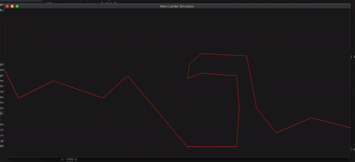

# cg_mars_lander_ga
A genetic algorithm for the CG Mars Lander challenge, written in Rust<br/>

---
## Demo



---
## Setup
If you do not have Rust
```
> curl --proto '=https' --tlsv1.2 -sSf https://sh.rustup.rs | sh
> export PATH=$PATH:$HOME/.cargo/bin
```
Then you can build the project
```
> cargo build --release
```

---
## Usage
```
> ./target/release/cg_mars_lander_ga <file>
```

### Flags
```
-h, --help       Prints help information
-V, --version    Prints version information
```

### Args
```
<file>    level file
```

### Want to make a level ?
A level is a file of 3 lines representing the initial ship parameters and the ground :<br/>
- line 1 -> position x and y of the ship<br/>
- line 2 -> angle, power, horizontal speed, vertical speed, fuel<br/>
- line 3 -> a list of points representing the ground<br/>

The map is 7000 wide and 3000 high<br/>
-90 <= angle <= 90<br/>
0 <= power <= 4<br/>

For example, the demo gif above is represented by :
```
6500 2000
0 0 0 0 1200
0 1800,300 1200,1000 1550,2000 1200,2500 1650,3700 220,4700 220,4750 1000,4700 1650,4000 1700,3700 1600,3750 1900,4000 2100,4900 2050,5100 1000,5500 500,6200 800,6999 600
```

### Commands
<p><kbd>Return</kbd> | launch the sequence</p>
<p><kbd>spacebar</kbd> | pause the autorotation</p>
<p><kbd>ESC</kbd> | close the visualisator</p>

---
## Contributors
<table>
  <tr>
    <td align="center"><a href="https://github.com/sgalasso42"><br /><sub><b>Simon Galasso</b></sub></a><br />
  </tr>
</table>
